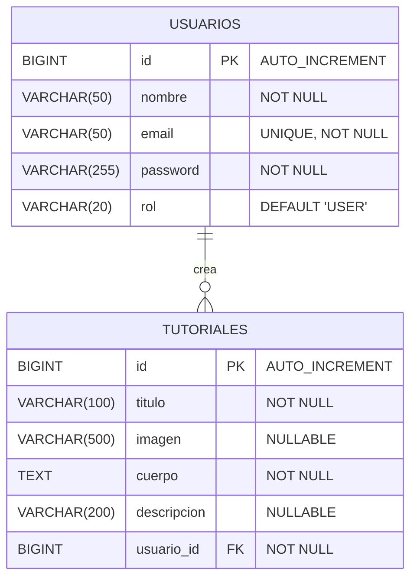

# EVALUACIÓN 2 - DESARROLLO DE APLICACIONES WEB
## Sistema de Gestión de Tutoriales de Desarrollo de Videojuegos

---

**Asignatura:** Desarrollo de Aplicaciones Web  
**Profesor:** [Nombre del Profesor]  
**Alumno:** [Tu Nombre]  
**Fecha:** Diciembre 2024  


---

## ÍNDICE

1. [Introducción](#1-introducción)
2. [Desarrollo - Documentación del Código](#2-desarrollo---documentación-del-código)
   - 2.1 [Modelo de Base de Datos](#21-modelo-de-base-de-datos)
   - 2.2 [Código de Entidades](#22-código-de-entidades)
   - 2.3 [Código de Repositorios](#23-código-de-repositorios)
   - 2.4 [Código de Servicios](#24-código-de-servicios)
   - 2.5 [Código de Controladores](#25-código-de-controladores)
   - 2.6 [Capturas Funcionales](#26-capturas-funcionales)
3. [Guía de Capturas](#3-guía-de-capturas)
4. [Conclusiones](#4-conclusiones)

---

## 1. INTRODUCCIÓN

### Objetivo del Trabajo
El objetivo de esta evaluación es desarrollar una aplicación web completa utilizando Spring Boot que permita gestionar tutoriales de desarrollo de videojuegos, implementando operaciones CRUD completas, autenticación de usuarios y una interfaz moderna con Bootstrap.

### Evolución desde la EV1
La aplicación ha evolucionado significativamente desde la Evaluación 1:

**EV1 - Estado Inicial:**
- Sistema básico de gestión de libros
- CRUD simple sin autenticación
- Interfaz básica con CSS personalizado
- Una sola entidad (Libro)

**EV2 - Estado Actual:**
- **Temática especializada:** Migración completa a tutoriales de desarrollo de videojuegos
- **Sistema de usuarios:** Implementación de registro, login y gestión de sesiones
- **Relaciones entre entidades:** Usuario ↔ Tutorial (OneToMany/ManyToOne)
- **Interfaz moderna:** Migración completa a Bootstrap 5.3.2
- **Funcionalidades avanzadas:** 
  - Acceso rápido por email
  - Gestión personal de tutoriales
  - Validación de URLs de imágenes
  - Navegación consistente
  - Tablas con esquinas redondeadas
- **Datos especializados:** 20+ tutoriales reales de Unity, C#, Godot, pixel art, etc.

---

## 2. DESARROLLO - DOCUMENTACIÓN DEL CÓDIGO

### 2.1 Modelo de Base de Datos

#### Diagrama de Entidades y Relaciones



#### Descripción de Entidades

**USUARIOS:**
- **id**: Clave primaria autoincremental
- **nombre**: Nombre completo del usuario (máx. 50 caracteres)
- **email**: Email único para login (máx. 50 caracteres)
- **password**: Contraseña del usuario
- **rol**: Rol del usuario (USER/ADMIN, por defecto USER)

**TUTORIALES:**
- **id**: Clave primaria autoincremental
- **titulo**: Título del tutorial (máx. 100 caracteres)
- **imagen**: URL de imagen del tutorial (máx. 500 caracteres)
- **cuerpo**: Contenido completo del tutorial (TEXT)
- **descripcion**: Descripción breve (máx. 200 caracteres)
- **usuario_id**: Clave foránea hacia USUARIOS

#### Relaciones
- **USUARIOS → TUTORIALES** (1:N): Un usuario puede crear múltiples tutoriales
- Relación implementada con `@OneToMany` y `@ManyToOne`
- Clave foránea: `usuario_id` en tabla TUTORIALES

### 2.2 Código de Entidades

#### Usuario.java
```java
@Entity
@Table(name = "usuarios")
public class Usuario {
    @Id
    @GeneratedValue(strategy = GenerationType.IDENTITY)
    private Long id;

    @Column(nullable = false, length = 50)
    private String nombre;

    @Column(nullable = false, unique = true, length = 50)
    private String email;

    @Column(nullable = false)
    private String password;

    @Column
    private String rol;

    @OneToMany(mappedBy = "usuario", cascade = CascadeType.ALL, fetch = FetchType.LAZY)
    private List<Tutorial> tutoriales = new ArrayList<>();

    // Constructor vacío requerido por JPA
    protected Usuario() {}

    // Constructor principal
    public Usuario(Long id, String nombre, String email, String password, String rol) {
        this.id = id;
        this.nombre = Objects.requireNonNull(nombre, "nombre no puede ser null");
        this.email = Objects.requireNonNull(email, "email no puede ser null");
        this.password = Objects.requireNonNull(password, "password no puede ser null");
        this.rol = Objects.requireNonNullElse(rol, "USER");
    }

    // Getters y setters...
}
```

#### Tutorial.java
```java
@Entity
@Table(name = "tutoriales")
public class Tutorial {
    @Id
    @GeneratedValue(strategy = GenerationType.IDENTITY)
    private Long id;

    @Column(nullable = false, length = 100)
    private String titulo;

    @Column(length = 500)
    private String imagen;

    @Column(columnDefinition = "TEXT")
    private String cuerpo;

    @Column(length = 200)
    private String descripcion;

    @ManyToOne(fetch = FetchType.LAZY)
    @JoinColumn(name = "usuario_id", nullable = false)
    private Usuario usuario;

    // Constructor vacío requerido por JPA
    protected Tutorial() {}

    // Constructor principal
    public Tutorial(Long id, String titulo, String imagen, String cuerpo, String descripcion, Usuario usuario) {
        this.id = id;
        this.titulo = Objects.requireNonNull(titulo, "titulo no puede ser null");
        this.imagen = imagen;
        this.cuerpo = Objects.requireNonNull(cuerpo, "cuerpo no puede ser null");
        this.descripcion = descripcion;
        this.usuario = Objects.requireNonNull(usuario, "usuario no puede ser null");
    }

    // Getters y setters...
}
```

### 2.3 Código de Repositorios

#### UsuarioRepository.java
```java
@Repository
public interface UsuarioRepository extends JpaRepository<Usuario, Long> {
    Optional<Usuario> findByEmail(String email);
    boolean existsByEmail(String email);
}
```

#### TutorialRepository.java
```java
@Repository
public interface TutorialRepository extends JpaRepository<Tutorial, Long> {
    List<Tutorial> findByUsuarioId(Long usuarioId);
    List<Tutorial> findByUsuarioIdOrderByIdDesc(Long usuarioId);
}
```

### 2.4 Código de Servicios

#### IUsuarioService.java (Interface)
```java
public interface IUsuarioService {
    List<Usuario> listarTodos();
    Optional<Usuario> buscarPorId(Long id);
    Optional<Usuario> buscarPorEmail(String email);
    Usuario guardar(Usuario usuario);
    void eliminar(Long id);
    boolean validarLogin(String email, String password);
    boolean existeEmail(String email);
}
```

#### UsuarioServiceImpl.java (Implementación)
```java
@Service
public class UsuarioServiceImpl implements IUsuarioService {
    
    @Autowired
    private UsuarioRepository usuarioRepository;

    @Override
    public List<Usuario> listarTodos() {
        return usuarioRepository.findAll();
    }

    @Override
    public Optional<Usuario> buscarPorId(Long id) {
        return usuarioRepository.findById(id);
    }

    @Override
    public Optional<Usuario> buscarPorEmail(String email) {
        return usuarioRepository.findByEmail(email);
    }

    @Override
    public Usuario guardar(Usuario usuario) {
        return usuarioRepository.save(usuario);
    }

    @Override
    public void eliminar(Long id) {
        usuarioRepository.deleteById(id);
    }

    @Override
    public boolean validarLogin(String email, String password) {
        Optional<Usuario> usuario = usuarioRepository.findByEmail(email);
        return usuario.isPresent() && usuario.get().password().equals(password);
    }

    @Override
    public boolean existeEmail(String email) {
        return usuarioRepository.existsByEmail(email);
    }
}
```

#### ITutorialService.java (Interface)
```java
public interface ITutorialService {
    List<Tutorial> listarTodos();
    Optional<Tutorial> buscarPorId(Long id);
    List<Tutorial> listarPorUsuarioId(Long usuarioId);
    Tutorial guardar(Tutorial tutorial);
    void eliminar(Long id);
}
```

#### TutorialServiceImpl.java (Implementación)
```java
@Service
public class TutorialServiceImpl implements ITutorialService {
    
    @Autowired
    private TutorialRepository tutorialRepository;

    @Override
    public List<Tutorial> listarTodos() {
        return tutorialRepository.findAll();
    }

    @Override
    public Optional<Tutorial> buscarPorId(Long id) {
        return tutorialRepository.findById(id);
    }

    @Override
    public List<Tutorial> listarPorUsuarioId(Long usuarioId) {
        return tutorialRepository.findByUsuarioIdOrderByIdDesc(usuarioId);
    }

    @Override
    public Tutorial guardar(Tutorial tutorial) {
        return tutorialRepository.save(tutorial);
    }

    @Override
    public void eliminar(Long id) {
        tutorialRepository.deleteById(id);
    }
}
```

### 2.5 Código de Controladores

#### UsuarioController.java
```java
@Controller
public class UsuarioController {

    @Autowired
    private IUsuarioService usuarioService;
    
    @Autowired
    private ITutorialService tutorialService;

    @GetMapping("/")
    public String inicio() {
        return "redirect:/login";
    }

    @GetMapping("/login")
    public String mostrarLogin() {
        return "login";
    }

    @PostMapping("/login")
    public String procesarLogin(@RequestParam String email, @RequestParam String password,
            HttpSession session, RedirectAttributes redirectAttributes) {
        if (usuarioService.validarLogin(email, password)) {
            Usuario usuario = usuarioService.buscarPorEmail(email).orElse(null);
            if (usuario != null) {
                session.setAttribute("usuarioLogueado", usuario);
                return "redirect:/tutoriales";
            }
        }
        redirectAttributes.addFlashAttribute("error", "Credenciales incorrectas");
        return "redirect:/login";
    }

    @GetMapping("/registro")
    public String mostrarRegistro(Model model) {
        model.addAttribute("usuario", new Usuario(null, "", "", "", "USER"));
        return "registro";
    }

    @PostMapping("/registro")
    public String procesarRegistro(@RequestParam String nombre, @RequestParam String email,
            @RequestParam String password, RedirectAttributes redirectAttributes) {
        if (usuarioService.existeEmail(email)) {
            redirectAttributes.addFlashAttribute("error", "El email ya existe");
            return "redirect:/registro";
        }

        Usuario usuario = new Usuario(null, nombre, email, password, "USER");
        usuarioService.guardar(usuario);
        redirectAttributes.addFlashAttribute("success", "Usuario registrado exitosamente");
        return "redirect:/login";
    }

    @GetMapping("/usuarios")
    public String listarUsuarios(Model model) {
        model.addAttribute("usuarios", usuarioService.listarTodos());
        return "usuarios";
    }

    @PostMapping("/usuarios/eliminar/{id}")
    public String eliminarUsuario(@PathVariable Long id, RedirectAttributes redirectAttributes) {
        usuarioService.eliminar(id);
        redirectAttributes.addFlashAttribute("success", "Usuario eliminado");
        return "redirect:/usuarios";
    }

    @GetMapping("/api/usuario-por-email")
    @ResponseBody
    public Map<String, Object> buscarUsuarioPorEmail(@RequestParam String email) {
        Map<String, Object> response = new HashMap<>();
        Optional<Usuario> usuario = usuarioService.buscarPorEmail(email);
        if (usuario.isPresent()) {
            response.put("id", usuario.get().id());
            response.put("nombre", usuario.get().nombre());
        }
        return response;
    }
}
```

#### TutorialController.java
```java
@Controller
@RequestMapping("/mis-tutoriales")
public class TutorialController {
    
    @Autowired
    private ITutorialService tutorialService;
    
    @Autowired
    private IUsuarioService usuarioService;

    @GetMapping("/{usuarioId}")
    public String misTutoriales(@PathVariable Long usuarioId, HttpSession session, Model model) {
        Usuario usuarioSesion = (Usuario) session.getAttribute("usuarioLogueado");
        Usuario usuario = usuarioService.buscarPorId(usuarioId).orElse(null);
        
        if (usuario == null) {
            return "redirect:/login";
        }
        
        if (usuarioSesion != null && !usuarioSesion.id().equals(usuarioId)) {
            return "redirect:/mis-tutoriales/" + usuarioSesion.id();
        }
        
        model.addAttribute("usuario", usuario);
        model.addAttribute("tutoriales", tutorialService.listarPorUsuarioId(usuarioId));
        return "mis-tutoriales";
    }

    @PostMapping("/{usuarioId}/crear")
    public String crearTutorial(@PathVariable Long usuarioId,
                               @RequestParam String titulo,
                               @RequestParam String imagen,
                               @RequestParam String descripcion,
                               @RequestParam String cuerpo,
                               RedirectAttributes redirectAttributes) {
        
        Usuario usuario = usuarioService.buscarPorId(usuarioId).orElse(null);
        if (usuario == null) {
            return "redirect:/login";
        }
        
        if (imagen != null && imagen.length() > 500) {
            redirectAttributes.addFlashAttribute("error", "La URL de imagen es demasiado larga");
            return "redirect:/mis-tutoriales/" + usuarioId;
        }
        
        Tutorial tutorial = new Tutorial(null, titulo, imagen, cuerpo, descripcion, usuario);
        tutorialService.guardar(tutorial);
        redirectAttributes.addFlashAttribute("success", "Tutorial creado exitosamente");
        return "redirect:/mis-tutoriales/" + usuarioId;
    }

    @PostMapping("/{usuarioId}/eliminar/{tutorialId}")
    public String eliminarTutorial(@PathVariable Long usuarioId, @PathVariable Long tutorialId,
                                  RedirectAttributes redirectAttributes) {
        tutorialService.eliminar(tutorialId);
        redirectAttributes.addFlashAttribute("success", "Tutorial eliminado");
        return "redirect:/mis-tutoriales/" + usuarioId;
    }

    @GetMapping("/{usuarioId}/editar/{tutorialId}")
    public String editarTutorial(@PathVariable Long usuarioId, @PathVariable Long tutorialId, Model model) {
        Tutorial tutorial = tutorialService.buscarPorId(tutorialId).orElse(null);
        Usuario usuario = usuarioService.buscarPorId(usuarioId).orElse(null);
        
        if (tutorial == null || usuario == null) {
            return "redirect:/mis-tutoriales/" + usuarioId;
        }
        
        model.addAttribute("tutorial", tutorial);
        model.addAttribute("usuario", usuario);
        return "editar-tutorial";
    }

    @PostMapping("/{usuarioId}/actualizar/{tutorialId}")
    public String actualizarTutorial(@PathVariable Long usuarioId, @PathVariable Long tutorialId,
                                    @RequestParam String titulo,
                                    @RequestParam String imagen,
                                    @RequestParam String descripcion,
                                    @RequestParam String cuerpo,
                                    RedirectAttributes redirectAttributes) {
        
        Tutorial tutorial = tutorialService.buscarPorId(tutorialId).orElse(null);
        if (tutorial != null) {
            if (imagen != null && imagen.length() > 500) {
                redirectAttributes.addFlashAttribute("error", "La URL de imagen es demasiado larga");
                return "redirect:/mis-tutoriales/" + usuarioId;
            }
            
            tutorial.setTitulo(titulo);
            tutorial.setImagen(imagen);
            tutorial.setDescripcion(descripcion);
            tutorial.setCuerpo(cuerpo);
            tutorialService.guardar(tutorial);
            redirectAttributes.addFlashAttribute("success", "Tutorial actualizado");
        }
        
        return "redirect:/mis-tutoriales/" + usuarioId;
    }
}
```

### 2.6 Capturas Funcionales

#### Pantalla de Login

*Sistema de autenticación con validación de credenciales y Bootstrap*

#### Lista de Usuarios (Admin)

*Gestión de usuarios con operaciones CRUD y tablas redondeadas*

#### Catálogo de Tutoriales

*Vista pública de tutoriales con diseño de cards Bootstrap*

#### Gestión Personal de Tutoriales

*CRUD completo para tutoriales del usuario logueado*

#### Vista Detallada de Tutorial

*Visualización completa del contenido del tutorial*

#### Acceso Rápido

*Funcionalidad de acceso directo por email*

---

## 3. GUÍA DE CAPTURAS

### Capturas Requeridas para la Documentación

#### 3.1 Capturas de Código (IDE)

**Entidades (@Entity)**
- [ ] `Usuario.java` - Mostrar anotaciones JPA y relación OneToMany
- [ ] `Tutorial.java` - Mostrar anotaciones JPA y relación ManyToOne

**Repositorios (@Repository)**  
- [ ] `UsuarioRepository.java` - Interface con métodos personalizados
- [ ] `TutorialRepository.java` - Interface con consultas por usuario

**Servicios (@Service)**
- [ ] `IUsuarioService.java` - Interface del servicio
- [ ] `UsuarioServiceImpl.java` - Implementación con @Autowired
- [ ] `ITutorialService.java` - Interface del servicio
- [ ] `TutorialServiceImpl.java` - Implementación

**Controladores (@Controller)**
- [ ] `UsuarioController.java` - Métodos de login y gestión de usuarios
- [ ] `TutorialController.java` - CRUD completo de tutoriales

#### 3.2 Capturas Funcionales (Navegador)

**Sistema de Autenticación**
- [ ] **login.png** - Pantalla de login con formulario Bootstrap
- [ ] **registro.png** - Formulario de registro de usuarios
- [ ] **acceso-rapido.png** - Funcionalidad de acceso rápido por email

**Gestión de Usuarios**
- [ ] **usuarios.png** - Lista de usuarios con tabla redondeada
- [ ] **usuarios-crud.png** - Demostrar eliminación de usuario

**Gestión de Tutoriales**
- [ ] **tutoriales.png** - Catálogo público con cards Bootstrap
- [ ] **mis-tutoriales.png** - Gestión personal con formulario de creación
- [ ] **crear-tutorial.png** - Formulario de creación funcionando
- [ ] **editar-tutorial.png** - Formulario de edición con datos precargados
- [ ] **ver-tutorial.png** - Vista detallada de un tutorial

**Funcionalidades Especiales**
- [ ] **tutoriales-usuario.png** - Tutoriales de un usuario específico
- [ ] **navegacion.png** - Navbar Bootstrap con enlaces activos
- [ ] **responsive.png** - Vista móvil/responsive

#### 3.3 Capturas de Base de Datos
- [ ] **bd-usuarios.png** - Tabla usuarios con datos de prueba
- [ ] **bd-tutoriales.png** - Tabla tutoriales con relaciones
- [ ] **bd-relaciones.png** - Demostrar foreign keys

### Organización de Archivos

```
capturas/
├── codigo/
│   ├── entidades/
│   ├── repositorios/
│   ├── servicios/
│   └── controladores/
├── funcional/
│   ├── autenticacion/
│   ├── usuarios/
│   └── tutoriales/
└── base-datos/
```

### Instrucciones para las Capturas

**Para Código (IDE):**
1. Abrir archivo en el IDE
2. Asegurar que se vean las anotaciones importantes (@Entity, @Repository, etc.)
3. Capturar con buena resolución
4. Incluir nombre del archivo en la captura

**Para Funcionalidades (Navegador):**
1. Usar datos de prueba realistas
2. Mostrar URLs en la barra de direcciones
3. Capturar pantalla completa o ventana del navegador
4. Demostrar funcionalidad real (formularios enviados, datos guardados, etc.)

**Para Base de Datos:**
1. Usar herramienta de administración de BD o consola H2
2. Mostrar estructura de tablas y datos
3. Evidenciar relaciones entre tablas

---

## 4. CONCLUSIONES

### Logros Alcanzados
1. **Migración completa a Bootstrap 5.3.2** eliminando cientos de líneas de CSS personalizado
2. **Sistema de autenticación robusto** con gestión de sesiones
3. **CRUD completo** para usuarios y tutoriales con validaciones
4. **Relaciones JPA** correctamente implementadas (OneToMany/ManyToOne)
5. **Interfaz moderna y responsive** con componentes Bootstrap
6. **Datos especializados** en desarrollo de videojuegos (Unity, C#, Godot, etc.)
7. **Funcionalidades avanzadas** como acceso rápido y validación de URLs
8. **Tablas redondeadas** para mejor aspecto visual

### Tecnologías Utilizadas
- **Backend:** Spring Boot 3.x, Spring Data JPA, Hibernate
- **Frontend:** Thymeleaf, Bootstrap 5.3.2, HTML5
- **Base de Datos:** H2 Database (desarrollo)
- **Arquitectura:** MVC (Model-View-Controller)
- **Patrones:** Repository, Service Layer, DTO

### Evolución del Proyecto

| Aspecto | EV1 (Libros) | EV2 (Tutoriales) |
|---------|--------------|------------------|
| Entidades | 1 (LIBROS) | 2 (USUARIOS, TUTORIALES) |
| Relaciones | Ninguna | 1:N (Usuario-Tutorial) |
| Autenticación | No | Sí (login/registro) |
| Interfaz | CSS personalizado | Bootstrap 5.3.2 |
| Campos | básicos | especializados + URLs |
| Datos | genéricos | videojuegos específicos |
| Funcionalidades | CRUD básico | CRUD + sesiones + validaciones |

El proyecto ha evolucionado de un simple CRUD de libros a una aplicación web completa especializada en tutoriales de desarrollo de videojuegos, con autenticación, gestión de usuarios, interfaz moderna y funcionalidades avanzadas, demostrando el dominio de Spring Boot y las mejores prácticas de desarrollo web.